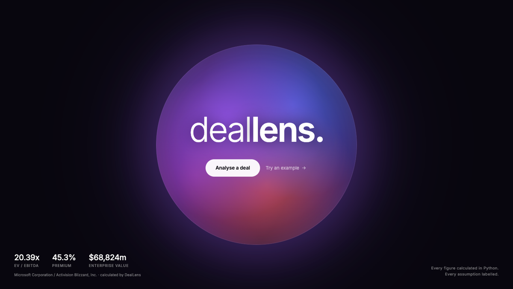
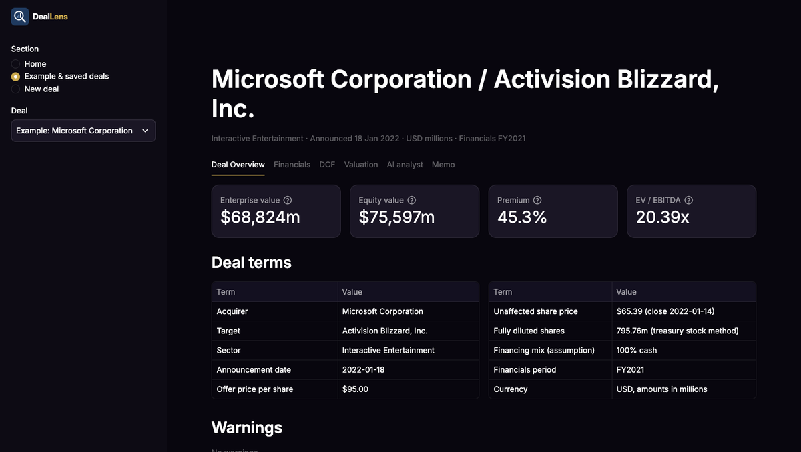
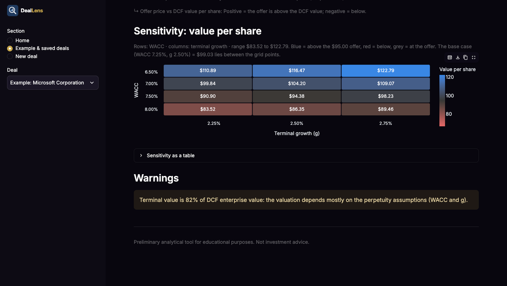
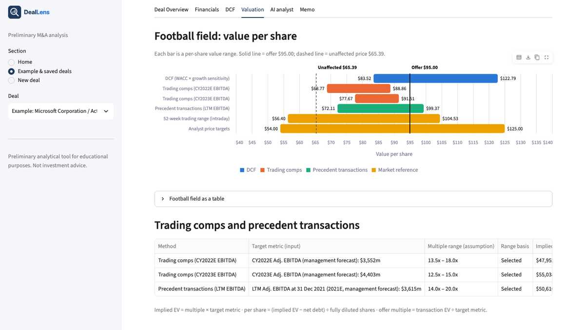
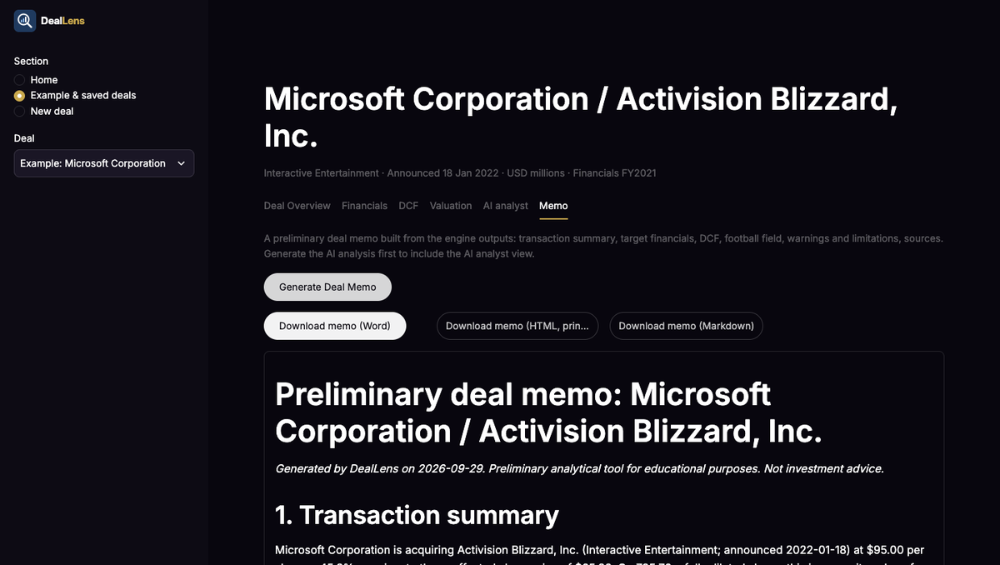

# DealLens — AI-Powered M&A Analyst

**Preliminary M&A analysis in minutes: valuation, premium and a deal memo, with
every figure calculated in Python and traced to its source.**

**Live demo:** _link added after deployment_ · Built by Anna Kissajikian

> Preliminary analytical tool for educational purposes. Not investment advice.



## What it does

- **Transaction engine**: equity value, enterprise value, premium, trading and
  transaction multiples, synergy-adjusted multiples, financing split.
- **Fully diluted shares** by the treasury stock method (options by tranche,
  RSUs/PSUs).
- **DCF** with a colour-coded WACC × terminal-growth sensitivity heatmap.
- **Trading comps and precedent transactions**, lined up with the DCF and
  market reference ranges on a **football field** against the offer price.
- **AI analyst** (Claude): interprets the engine's outputs, never calculates;
  every sentence is tagged fact / assumption / calculated / AI interpretation,
  and a **number checker** removes any figure the engine did not produce.
  Includes a chat box: *Ask a question about this deal*, answered under the
  same rules (anything not calculated is reported as unavailable).
- **Deal memo**: one click, downloadable as HTML (prints to PDF) or Markdown.
- **New deal form** with validation shown next to each field, plus JSON
  download, so any deal can be analysed.

## The example: Microsoft / Activision Blizzard (Jan 2022)

Every input comes from Activision's FY2021 10-K, the merger proxy (DEFM14A)
and Microsoft's announcement, with the document, page and a quoted snippet
recorded for each figure.

| Output | DealLens | Published cross-check |
|---|---|---|
| Enterprise value at the $95.00 offer | $68,824m | $68.7bn headline "inclusive of net cash" (+0.18%) |
| Premium to the $65.39 unaffected close | 45.3% | "approximately 45.3%" (proxy) |
| DCF value per share (WACC 7.25%, g 2.50%) | $99.03 | — |
| DCF range over Allen & Co's WACC / growth ranges | $83.52–$122.79 | $84.73–$123.87 (fairness opinion) |
| Comps / precedents per-share ranges | within 1% of Allen & Co's | proxy pp.55–56 |

| | |
|---|---|
|  |  |
|  |  |

## How it works

```
deal JSON / New deal form ──> utils/io.deal_from_dict() ──> finance/ (validation + formulas)
                                                               │  Metric objects: value, formula,
                                                               │  fact / assumption provenance
             ┌──────────────────────────┬──────────────────────┴─────────────┐
             ▼                          ▼                                    ▼
   ui/ (Streamlit tabs,          ai/ payload ──> Claude ──> number     reports/memo.py
   display only)                 checker (rejects unproduced figures)  (templates filled
                                                                       with engine figures)
```

Design rules: **Python calculates, AI interprets** (`finance/` never imports
`ai/`); **no invented data** (a missing figure is "unavailable", never
guessed); **facts, assumptions, calculated figures and AI interpretation stay
labelled** everywhere; every formula has **hand-calculated tests** (277 tests,
including headless tests of the web app).

**Tech stack:** Python 3 · Streamlit · Altair · pandas · Anthropic Claude API
(`claude-opus-5-5`, structured outputs) · pytest.

## Quick start

```bash
python -m venv .venv
source .venv/bin/activate          # Windows: .venv\Scripts\activate
pip install -r requirements.txt

python run_analysis.py             # illustrative test deal (round numbers)
python run_analysis.py data/sample_deals/microsoft_activision.json   # real deal
streamlit run app.py               # web app at http://localhost:8501
python -m pytest -v                # run the tests
```

## Project structure

```
deal-lens/
├── app.py                       # Streamlit web app (display only, no calculations)
├── assets/                      # logo (SVG)
├── run_analysis.py              # command-line demo
├── ui/
│   ├── ai_panel.py              # AI analyst tab
│   ├── dcf.py                   # DCF tab: schedule, valuation, sensitivity heatmap
│   ├── deal_form.py             # New deal form: grouped inputs, inline errors, export
│   ├── overview.py              # Deal Overview tab: headline tiles, deal terms, warnings
│   ├── valuation.py             # Valuation tab: football field, comps and precedents
│   ├── financials.py            # Financials tab: tagged tables and sources
│   ├── home.py                  # landing page
│   ├── settings.py              # deployment settings from secrets / environment
│   └── memo_panel.py            # Memo tab: generate + download
├── .streamlit/config.toml       # app theme (secrets.toml.example: deployment settings)
├── docs/screenshots/            # images used in this README
├── finance/                     # deterministic engine, no AI
│   ├── models.py                # DealInfo, DealFacts, DealAssumptions, Metric
│   ├── validation.py            # errors (stop) and warnings (review)
│   ├── dilution.py              # fully diluted shares (treasury stock method)
│   ├── dcf.py                   # DCF valuation + WACC × growth sensitivity
│   ├── comps.py                 # comps / precedents ranges + football field bars
│   └── transaction.py           # the formulas
├── ai/                          # AI analyst: interprets, never calculates
│   ├── payload.py               # the only data the model sees, with provenance tags
│   ├── number_checker.py        # rejects figures the engine did not produce
│   └── analyst.py               # Claude API call (structured output) + checks
├── reports/
│   └── memo.py                  # deal memo (HTML + Markdown), templates filled by the engine
├── utils/
│   ├── io.py                    # JSON file -> DealInputs
│   └── formatting.py            # 13.60x, 20.0%, $6,000m, n.m.
├── data/
│   ├── sample_deals/microsoft_activision.json  # real deal, every figure sourced
│   ├── sources/                                # saved evidence (e.g. share price screenshot)
│   └── user_deals/                             # deals saved from the app's New deal form
└── tests/
    ├── conftest.py              # isolated deal folders for app tests
    ├── fixtures/illustrative_deal.json  # round-number test deal (not shown in the app)
    ├── test_transaction.py      # hand-calculated finance results
    ├── test_dilution.py         # hand-calculated treasury stock method
    ├── test_dcf.py              # hand-calculated DCF and sensitivity grid
    ├── test_comps.py            # hand-calculated comps, precedents, football field
    ├── test_ai.py               # payload, number checker, statement checks (no API calls)
    ├── test_memo.py             # memo content; no number the engine did not produce
    ├── test_activision.py       # real-deal regression test
    ├── test_app.py              # web app, run headless with Streamlit AppTest
    ├── test_deal_form.py        # New deal form: conversions, saving, headless form runs
    └── test_validation.py       # rejected and flagged inputs
```

## Web app

`streamlit run app.py` opens the landing page. The sidebar has three sections:

- **Home**: *Analyse a deal* (opens the form) or *Try the example*.
- **Example & saved deals**: the Microsoft / Activision example ("Example: …")
  and deals you saved ("Saved: …"), with tabs **Deal Overview**,
  **Financials** (every figure tagged Fact, Fact · derived, Assumption,
  Calculated or Calculated · uses assumptions, and a Sources section with
  document, page and quoted snippet), **DCF**, **Valuation**, **AI analyst**
  and **Memo**.
- **New deal**: grouped inputs (deal info, deal terms, share count, target
  financials, assumptions, optional DCF, comps / precedents / reference
  ranges), optionally starting from an existing deal. *Run analysis* validates
  everything at once, with errors in a summary and under their group, and
  shows the same result tabs. Download the deal as JSON, or save it locally
  to `data/user_deals/`. Percentages are typed as 25 for 25%; blank optional
  fields mean "not provided", never zero.

The app only displays results: all numbers come from `finance/`.

## Deployment (Streamlit Community Cloud)

1. Push this repository to GitHub.
2. At share.streamlit.io, sign in with GitHub → *Create app* → pick the
   repository, branch `main`, main file `app.py`.
3. In the app's *Settings → Secrets*, paste the contents of
   `.streamlit/secrets.toml.example` with your real key:
   `ANTHROPIC_API_KEY` (AI analyst), `DEALLENS_AI_SESSION_LIMIT = 3` (caps AI
   calls per visitor session) and `DEALLENS_ALLOW_SAVE = "false"` (the cloud
   disk resets, so visitors download their deal instead).

## Conventions

- Money and shares in **millions**; prices **per share**.
- Percentages as decimals: `0.30` = 30%.
- Multiples with a missing, zero or negative denominator show **n.m.**
- Metrics marked **[A]** (terminal) or tagged "uses assumptions" (app) depend on
  user assumptions; all others use facts only.

## Formulas

| Metric | Formula |
|---|---|
| Options exercised (TSM) | Σ options with strike < offer price, tranche by tranche |
| Shares repurchased (TSM) | Σ (options × strike) ÷ offer price |
| Fully diluted shares | Basic shares + options exercised − shares repurchased + RSUs/PSUs |
| PV of forecast FCF (DCF) | Σ FCF_t ÷ (1 + WACC)^t, end of each year |
| Terminal value (DCF) | FCF_N × (1 + g) ÷ (WACC − g) (Gordon growth) |
| DCF value per share | (Σ PV + PV of terminal value − net debt) ÷ fully diluted shares |
| Comps / precedents per share | (multiple × target metric − net debt) ÷ fully diluted shares |
| Default multiple range | 25th–75th percentile of the peers (when no range is selected) |
| Transaction equity value | Offer price × Fully diluted shares |
| Transaction enterprise value | Equity value + Debt − Cash |
| Acquisition premium | Offer price ÷ Unaffected (pre-announcement) price − 1 |
| EV / Revenue, EV / EBITDA, EV / EBIT | Transaction EV ÷ metric |
| Equity value / Net income | Transaction equity value ÷ Net income |
| Unaffected EV / EBITDA | (Unaffected price × Diluted shares + Debt − Cash) ÷ EBITDA |
| Revenue synergy EBITDA contribution | Revenue synergies × Incremental margin |
| Pro forma EBITDA | EBITDA + Cost synergies + Revenue synergy EBITDA contribution |
| Synergy-adjusted EV / EBITDA | Transaction EV ÷ Pro forma EBITDA |
| Financing split | Equity value × share of cash / debt / stock |

## Share count

Either enter `diluted_shares_outstanding` directly, or give a `share_build`
in `facts` and DealLens calculates it with the treasury stock method:

```json
"share_build": {
  "basic_shares": 100,
  "option_tranches": [{"number": 6, "strike": 30}, {"number": 4, "strike": 45}],
  "rsus": 2,
  "as_of": "basic 2026-01-10; awards 2025-12-31"
}
```

If both are given, the share build is used and a difference above 1% is flagged.

## Real deal: Microsoft / Activision Blizzard (announced 18 Jan 2022)

Inputs come from Activision's FY2021 10-K, the DEFM14A merger proxy (including
the Merger Agreement) and Microsoft's press release. Each figure's document,
section, page and snippet is recorded under `_sources` in the deal file.

| Output | Value |
|---|---|
| Fully diluted shares (TSM, 13 Jan 2022) | 795.76m |
| Equity value / Enterprise value | $75,597m / $68,824m |
| Premium to 14 Jan 2022 close ($65.39) | 45.3% (proxy: "approximately 45.3%") |
| EV / Revenue, EV / EBITDA (FY2021) | 7.82x, 20.39x |

Cross-check: Microsoft's $68.7bn headline is "inclusive of Activision
Blizzard's net cash", so it is compared with our **enterprise value**
(+0.18%), not equity value.

Judgements specific to this deal: EBITDA = operating income + D&A (capitalised
software amortisation not added back); gross debt of 3,650 rather than the
3,608 carrying value; PSUs at target; all options as one tranche at the
$57.77 weighted-average strike (no range table in the 10-K); synergies set to
zero because none were disclosed. The unaffected close is not stated in the
proxy; it comes from Investing.com (screenshot in `data/sources/`) and matches
the proxy's 45.3% premium.

## DCF (Activision example)

Management's unlevered free cash flow forecast for 2022E–2026E (DEFM14A p.51)
is discounted to 31 Dec 2021 at the midpoint of Allen & Company's ranges
(WACC 7.25%, terminal growth 2.50%; p.57): **$99.03 per share**, so the $95.00
offer is 4.1% below the DCF value. Over Allen & Company's full ranges the
heatmap gives **$83.52–$122.79** against their published **$84.73–$123.87**.
Terminal value is 82% of DCF EV, which the app flags.

## Comps, precedents and football field (Activision example)

Allen & Company's selected multiple ranges (DEFM14A p.55–56) applied to
management's Adjusted EBITDA: trading comps 13.5–18.0x CY2022E → $68.77–$88.86
and 12.5–15.0x CY2023E → $77.67–$91.51; precedents 14.0–20.0x LTM →
$72.11–$99.37. Each is within 1% of Allen & Company's published ranges.
The football field adds the DCF range, the 52-week trading range
($56.40–$104.53) and analyst price targets ($54–$125) against the $95 offer.
Individual peer multiples are not disclosed in the proxy, so the example uses
the selected ranges; for new deals, peers can be typed into the form.

## AI analyst

The AI analyst tab sends Claude (`claude-opus-5-5`, via the official
`anthropic` SDK) a JSON payload of the engine's outputs, each tagged as a
fact, assumption, calculated figure or calculated-from-assumptions figure,
plus a list of unavailable data. The answer is a structured report of
one-sentence statements, each tagged fact / assumption / calculated / AI
interpretation and citing the payload items it uses. Before anything is
shown, every statement is checked: any number not in the payload (rounded,
converted or invented), an unknown item id, or a tag that does not match the
cited items gets the statement removed, and the reason is listed.

**Ask a question about this deal**: a chat box in the same tab. Each question
is one Claude call with the same tagged payload plus the conversation so far;
the answer comes back as tagged statements and goes through the same checks.
Only statements that passed are kept in the history, so a removed figure never
returns in later turns. Questions that need something the engine has not
calculated (a different WACC, offer price, synergy case) are answered as
unavailable, never estimated. Every analysis and every question counts toward
the per-session limit (`DEALLENS_AI_SESSION_LIMIT`, default 3).

Set-up: put `ANTHROPIC_API_KEY = "sk-ant-..."` in `.streamlit/secrets.toml`
(gitignored). Without a key the tab says the analyst is unavailable; all
other tabs work. Tests never read the secrets file or make API calls.

## Deal memo

*Generate Deal Memo* (Memo tab) builds a memo with a transaction summary,
target financials with sources, the DCF, a football field, warnings and
limitations, and the sources list. If an AI analysis was generated, it is
added as its own section with each statement tagged. Every sentence is a
Python template filled with engine figures; a test runs the number checker
over the whole memo to prove it contains no figure the engine did not produce.

## Limitations

- Enterprise value excludes preferred stock, minority interests, leases and
  pension liabilities.
- The treasury stock method is applied at the offer price, and that share
  count is also used for the unaffected equity value. At the lower unaffected
  price fewer options would be in the money, so unaffected equity value is
  slightly overstated.
- Each option tranche uses its weighted-average strike. Options inside a range
  can straddle the offer price; a finer table gives a more precise result.
- RSUs and PSUs count one share each; PSUs are counted at target.
- Convertible securities and warrants are not yet modelled.
- DCF: end-of-year discounting (no mid-year convention); Gordon-growth
  terminal value only; per-share value uses the fully diluted share count at
  the offer price; the forecast cash flows are taken as given (no revenue or
  margin build).
- Comps/precedents: one multiple per method (e.g. EV / EBITDA); no
  calendarisation or size adjustment; peers are entered manually.
- AI analyst: the number checker verifies figures and provenance tags, not
  the reasoning; interpretations can still be wrong and must be reviewed.
- A stated headline equity value is only a cross-check; the calculated figure
  is always used.
- If no incremental margin is given, revenue synergies use the target's
  EBITDA margin. This is flagged as an assumption and triggers a warning.
- Synergies are run-rate figures: no phasing, integration costs or valuation.
- The financing split shows how the consideration is funded. It is not pro
  forma leverage or accretion/dilution, which need acquirer financials.
